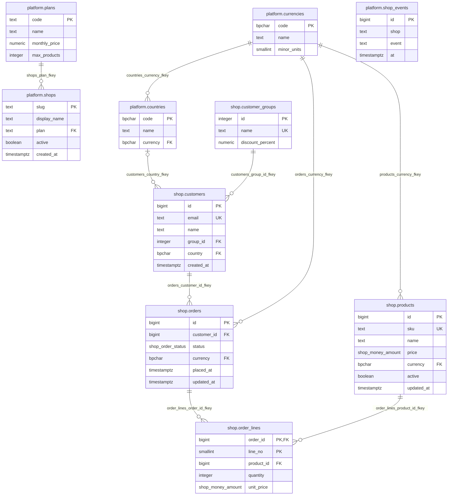

<!-- Generated by pgproj --erd -->
# Entity relationship diagram: storefront

Diagram source: [erd.mmd](erd.mmd). Generated 2026-10-22 12:47:16 UTC from the project's SQL files by `pgproj`.

```mermaid
erDiagram
    "platform.countries" {
        bpchar code PK
        text name
        bpchar currency FK
    }
    "platform.currencies" {
        bpchar code PK
        text name
        smallint minor_units
    }
    "platform.plans" {
        text code PK
        text name
        numeric monthly_price
        integer max_products
    }
    "platform.shops" {
        text slug PK
        text display_name
        text plan FK
        boolean active
        timestamptz created_at
    }
    "platform.shop_events" {
        bigint id PK
        text shop
        text event
        timestamptz at
    }
    "shop.customers" {
        bigint id PK
        text email UK
        text name
        integer group_id FK
        bpchar country FK
        timestamptz created_at
    }
    "shop.customer_groups" {
        integer id PK
        text name UK
        numeric discount_percent
    }
    "shop.orders" {
        bigint id PK
        bigint customer_id FK
        shop_order_status status
        bpchar currency FK
        timestamptz placed_at
        timestamptz updated_at
    }
    "shop.order_lines" {
        bigint order_id PK, FK
        smallint line_no PK
        bigint product_id FK
        integer quantity
        shop_money_amount unit_price
    }
    "shop.products" {
        bigint id PK
        text sku UK
        text name
        shop_money_amount price
        bpchar currency FK
        boolean active
        timestamptz updated_at
    }
    "platform.currencies" ||--o{ "platform.countries" : "countries_currency_fkey"
    "platform.plans" ||--o{ "platform.shops" : "shops_plan_fkey"
    "platform.countries" |o--o{ "shop.customers" : "customers_country_fkey"
    "shop.customer_groups" ||--o{ "shop.customers" : "customers_group_id_fkey"
    "platform.currencies" ||--o{ "shop.orders" : "orders_currency_fkey"
    "shop.customers" ||--o{ "shop.orders" : "orders_customer_id_fkey"
    "shop.orders" ||--o{ "shop.order_lines" : "order_lines_order_id_fkey"
    "shop.products" ||--o{ "shop.order_lines" : "order_lines_product_id_fkey"
    "platform.currencies" ||--o{ "shop.products" : "products_currency_fkey"
```
